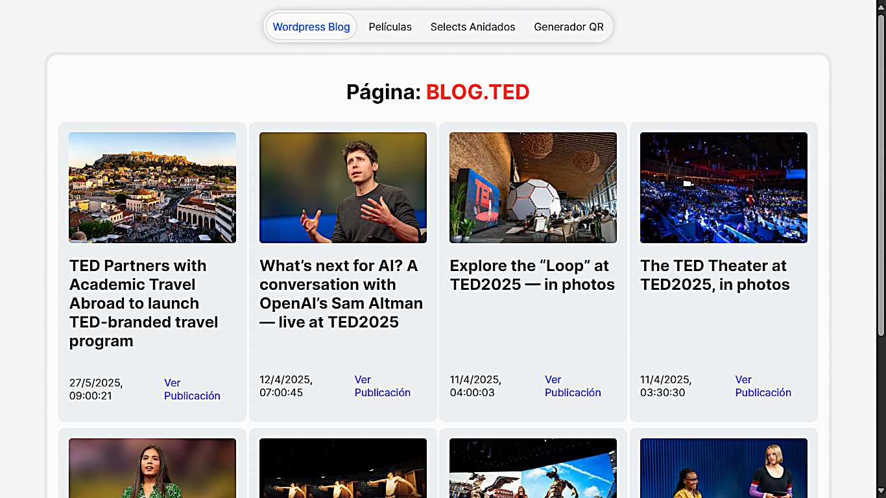
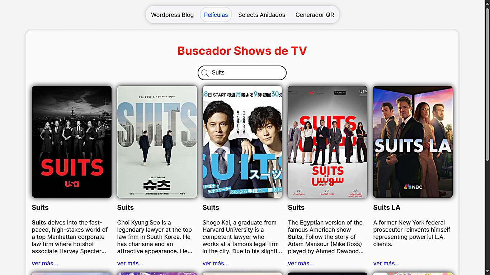
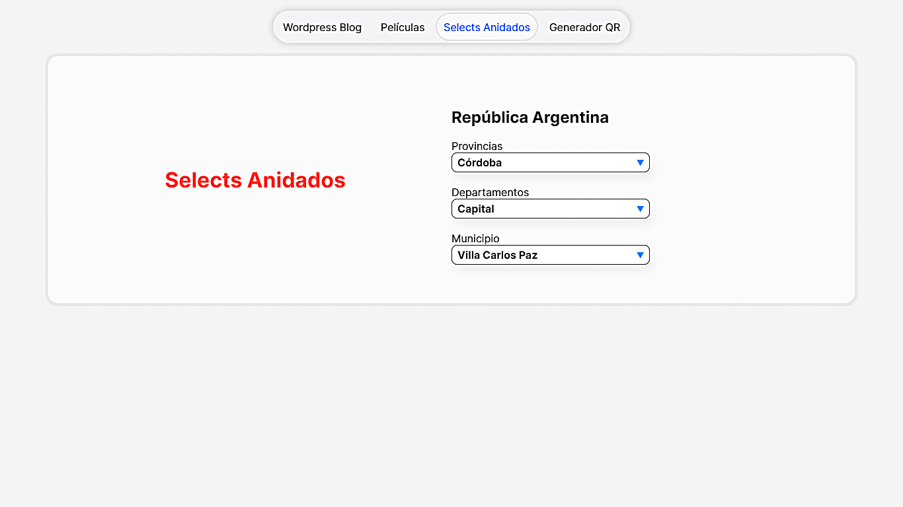
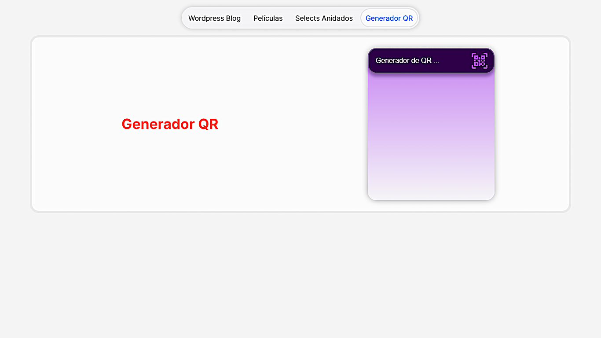

# 📘 SPA-api

Una aplicación de una sola página (SPA) que demuestra el consumo de múltiples APIs externas para resolver distintas necesidades dentro de una única interfaz web.

## 🎯 Objetivo del Proyecto

Mostrar mi habilidad como desarrollador web para integrar diferentes APIs en una SPA, adaptándome a distintos formatos de datos, servicios y flujos de interacción.

## 🛠️ Tecnologías Utilizadas

- **HTML**
- **CSS**
- **JavaScript**

## 📌 Funcionalidades / Secciones

Cada sección representa una pestaña dentro de la SPA, con integración a una API externa:

### 📰 WordPress Frontend

Frontend para un blog simple que consume contenido desde la **API REST de WordPress**, mostrando publicaciones y detalles.

### 🎬 Buscador de Películas

Formulario de búsqueda conectado a una API de películas que permite consultar fichas de películas, sinopsis, y más.

### 🗺️ Datos Geográficos de Argentina

Selector jerárquico de **provincia → departamento → municipio**, con datos en tiempo real obtenidos desde una API pública del gobierno argentino.

### 🔳 Generador de QR

Formulario que permite ingresar una URL o texto, y genera un código QR usando una **API de generación de códigos QR**.

## 🖥️ Capturas de pantalla

| Sección WordPress                                              | Buscador de Películas                                       |
| -------------------------------------------------------------- | ----------------------------------------------------------- |
|  |  |

| Selector Geográfico                                      | Generador QR                                           |
| -------------------------------------------------------- | ------------------------------------------------------ |
|  |  |
